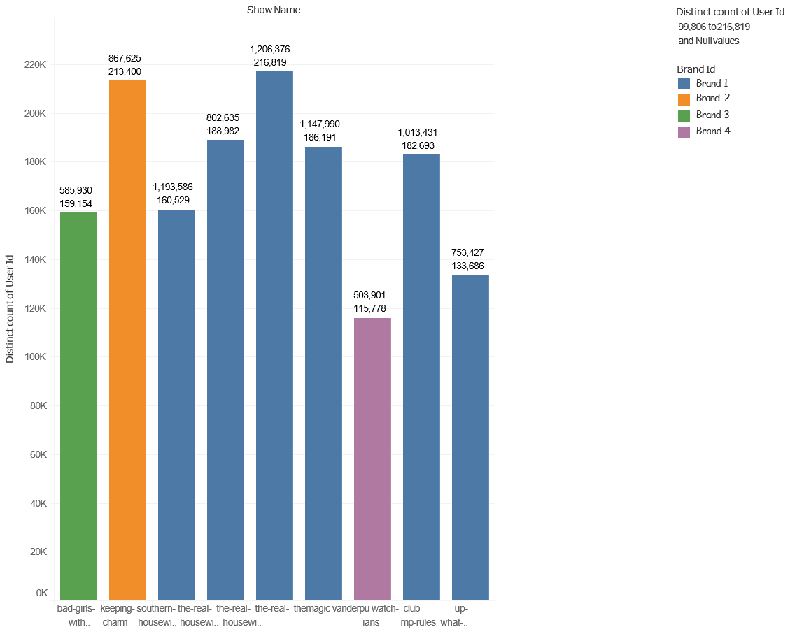
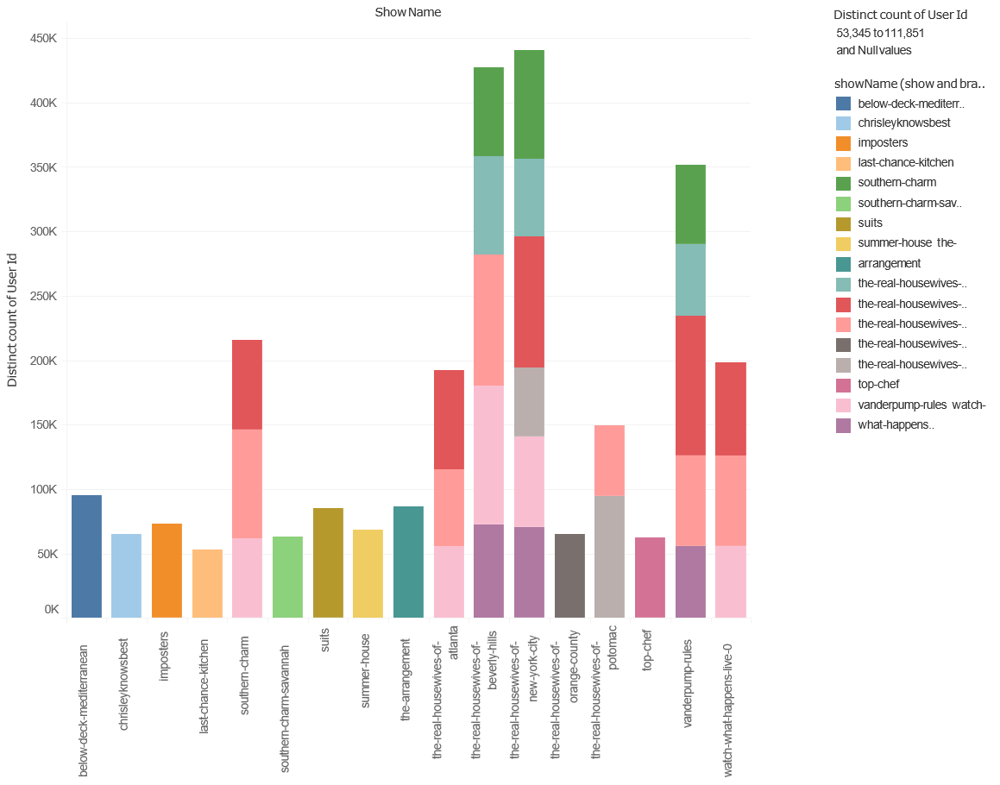
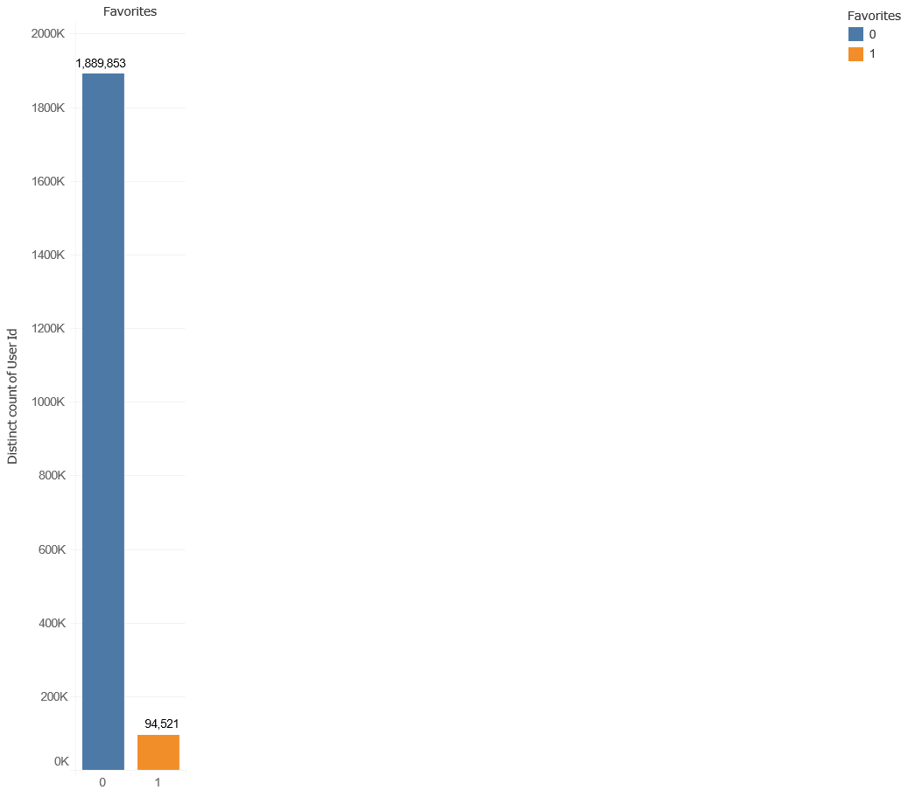

# Consumer IOS App Watching Analysis


## Executive Summary

According to a publication by Accenture in 2015, 89% of the users they surveyed watched some sort of long video on 
their mobile devices.

AT&T claims to have had a 75% increase in data usage over the past year.

Users are more glued to their mobile devices than ever and its only set to increase.

This internship focused on the first exploration of the data, with the hope of gaining meaningful insights on the behavior of consumers.

Due to the sensitive nature of the consumer data, exact results will not be disclosed in this report.

## Specific Project Description
### Overview
The watchTower data is stored for the sole purpose of ensuring that the mobile app users are able to continue watching a specific video from where they last stopped.

### Task
Since the data had never be analysed, I was tasked with carrying out analysis on it to see if there were useful insights within the data. Being given free rein on the technologies to use, as such, the programming language being used is R, while Tableau will be used for all visualizations.

## Research Goals

* Understand the habits of users per brand.

* Proffer ways of increasing the number of digital users across brands.


# Implementation

## Data Structure
The data from watchTower was extracted into 3 different csv files, each being approximately 7GB in size. Having 8 features, with over 20 million rows each.

## Stage 1: Data Cleaning and Pre-processing in R

The first step in the data cleaning process was to view the data in a simple text editor. This enabled me to understand the format of the data identify the following:

* Relevant data to be read into R

* characters like '{},"",:' that needed to be removed from the data frame. 

The sample of the raw data is as shown below:

```id,flags,expiration,cas,value,rev,vbid,dtype

072b53d0-0cd5-46d9-abf3-d1c04b73f68c,33554432,0,1482372320294338560,

"{""showId"":""7162758c-7540-4ef9-ada5-30215c8ba039"",""deleted"":false,

""favoriteType"":""shows"",""customFields"":{""device"":""IOS""},

""brandId"":""bravo"",""createdTimestamp"":1482372320289,""_class"":

""com.nbcuni.watchtower.api.model.Favorite"",""type"":""FAVORITES"",

""userId"":""b708e56537fa18aefb3c6180223a437138534f107e965c56b2e667562fb1dd79"",

""updatedTimestamp"":1482372320289}",3,818,1
```

Based on the sample above, I worte a function called "cleanWatchTower", which takes in the file name and retruns a list consisting of two separate data frames. One for the favorites data, and the other for the watches data. (please refer to the appendix for complete code). Next the function is used to call and clean the files, as shown below. Grouping them into favorites (the record of shows that have been marked as favorites by users), and watches (the record of show that a user was watching and its progress).


Running on the assumption that if a show has been marked by a user as a favorite, then it implies that the user has definitely watched the show. Conversely, that a user watches a show does not necessarily mean they will mark it as a favorite. 

As such, I wrote another function which utilizes an SQL query to join the watch data frame to the favorite data frame by their userId. Ensuring that only users found in the favorite are taken from the watch.

A new column called 'favorites' is created and all users that have marked shows as favorites are depicted by 1 in that column. Next, the users frow the watch data frame that were omitted from the initial SQL join are extracted from the original watch data frame and are also given a new column 'favorites' with 0 assigned to all fields, depicting "not marked as favorite".

After this the function merges the '0' and '1' data frames, churning out the final result. (please refer to the appendix for complete code).

Next the function is applied to the previously cleaned data, after which they are all combined into one data frame, as shown below.

### Stage 2: Preliminary Analysis in R

During the first assessment of the data set, there were 2 callenges faced.

1. The files were too large: This was handled by the fread function from the dplyr package, which enabled me to read only the necessary data into R.

2. There were transactions in the data with duplicate values.Since the transaction Ids were not important in this research, that variable was ignored, allowing for the removal of all duplicates.

### Stage 3: What Questions are We Trying to Answer?
After much brainstroming, the following questions came out on top.

* How many users are registered on more than one brand?

* How many usere watch more than one television show?

* At what time do users typically watch shows?

* How many users watch only the show in their favorites?

The following code below was used it carrying out the necessary computations to answer these questions.(please refer to the [code folder](codes) complete code)

After running the preliminary analysis code above, a clear path was realized, having gained sufficient answers to the questions above, a final computiation was run using the code below. 

This enabled me to have the data in a consolidated format, allowing for easy visualization.(please refer to the appendix for complete code)


### Stage 4: Visualizations in Tableau



#### This is a visual of the most popular shows by brand.

To better interpret the findings, the extreme user persona was created.

We have two types of extreme users, defined as follows:

#### Extreme User 1 
* Users loyal to one brand.

* They watch multiple shows consistently.

* They watch dedicatedly at specific time frames.

* They always complete viewing the videos they start.


#### Extreme User 2
* Users with two or more brands.

* They watch multiple shows consistently.

* They watch dedicatedly at specific time frames.

* They always complete viewing the videos they start. 



#### The visual above is of viewing habits in relation to a market basket analysis.



#### The visual above shows the impact of the favorites feature on user viewing.


### Stage 5: Insights

* App Usage: There are brands with excessive content in comparison to the number of users.

* Favorites: The favorites function does not add to the user experience.

* Outliers: There are users who do not fit in to the standard pattern. These are the extreme users.


# Recommendations and Conclusion
## Recommendations
* Carry out user surveys, grouping them based on their usage patterns. This will help in having a better understanding of the user patterns observed.

* Identify the motivation behind the usage pattern of extreme users

* Suggest shows to non-extreme users across brands based on the viewing patterns of users similar to them. The will encourage cross platform growth.

* Remove the favorites feature from the ios app as it has no added value.


## Conclusion

The field of big data analytics or data science is definitely industry agnostic. 

No matter how trival the data is, there always lies useful information some where within. 

Maybe already discovered, maybe not; but from this reasearch project I have learned that it is always worth a shot to analyse the data you have as it may have vital information the business needs to succeed.
